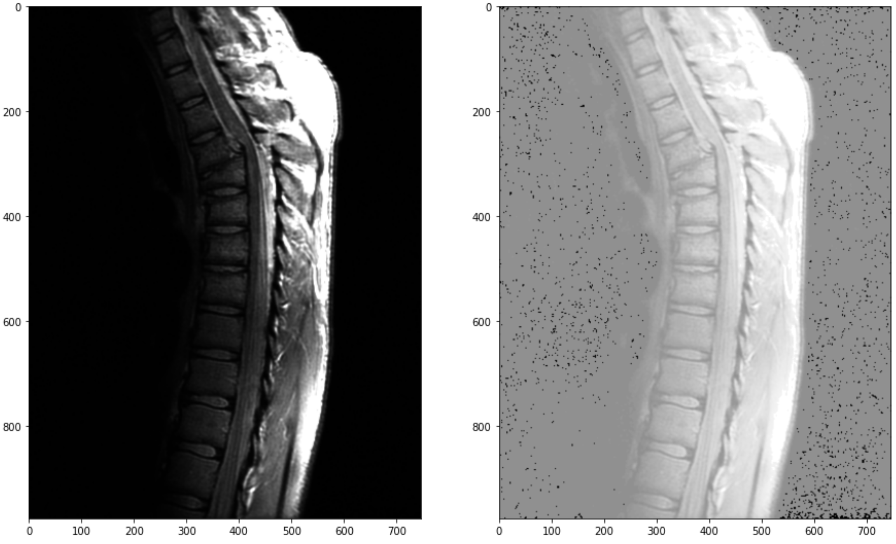

# Histogram Equalization for Medical Image Enhancement

This repository contains a Python script that performs histogram equalization on a grayscale image, showcasing how this technique can enhance the visibility of features within medical images. The application of this technique is vital in medical imaging, as it helps improve the diagnostic quality of images such as X-rays, CT scans, and MRIs.

## Overview

Histogram equalization is a technique used to improve the contrast of an image by effectively redistributing the intensity values. This can help in revealing hidden details in images that might be critical for medical diagnoses. The script reads a medical image, computes its histogram, and applies histogram equalization to enhance the image.

## Table of Contents

- [Prerequisites](#prerequisites)
- [Usage](#usage)
- [Example Result](#example-result)
- [Impact on Medical Images](#impact-on-medical-images)
- [License](#license)

## Prerequisites

Ensure you have the following libraries installed in your Google Colab environment:

- OpenCV
- NumPy
- Matplotlib

You can install the necessary libraries using pip:

```bash
!pip install opencv-python numpy matplotlib
```

## Usage

1. Clone the repository or download the code.

2. Replace the path to the image in the script with the path to your medical image file:

   ```python
   img = cv2.imread("/path/to/image.jpg")
   ```

3. Run the code cell. The code will display the original and the equalized image side by side, along with the normalized histogram and cumulative distribution function (CDF) plots.

## Example Result



This placeholder should be replaced with an actual image demonstrating the results of the histogram equalization process. Make sure to include a comparative image to highlight the enhancement in detail visibility.

## Impact on Medical Images

Histogram equalization plays a significant role in medical imaging by:

- **Enhancing Contrast**: It improves the visibility of structures in low-contrast images, making it easier for medical professionals to identify abnormalities.
- **Revealing Hidden Details**: Subtle features that are critical for diagnosis, such as tumors or fractures, may become more apparent after equalization.
- **Standardization**: Equalized images provide a more uniform brightness across the image, which can assist in consistent analysis and interpretation.

By applying this technique to various medical images, healthcare providers can make more informed decisions based on clearer and more detailed visual information.

## License

This project is licensed under the MIT License. See the [LICENSE](LICENSE) file for details.
